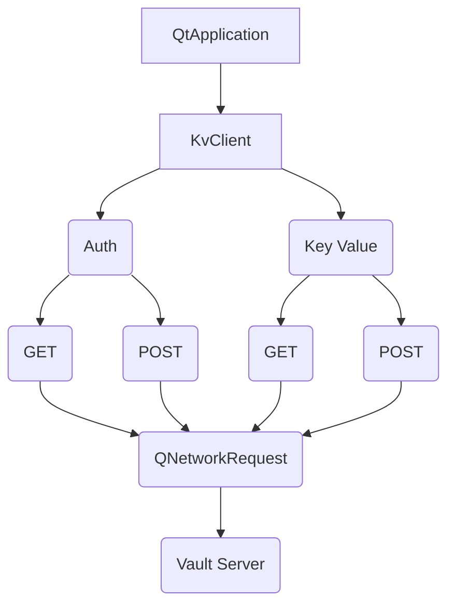

# QtVault

**Client for operation on the vault server.**


## Working architecture



## Prerequisits
>```bash
> mkdir myproject;
> cd myproject;
> git@github.com:flaviomarcio/qtvault.git
>```
>Check examples in qtvault/examples


## CMake Build information

>```
>## initial CMake parameters 
>
>-GNinja
>-DCMAKE_BUILD_TYPE:STRING=Debug
>-DCMAKE_PROJECT_INCLUDE_BEFORE:PATH=%{IDE:ResourcePath}/package-manager/auto-setup.cmake
>-DQT_QMAKE_EXECUTABLE:STRING=%{Qt:qmakeExecutable}
>-DCMAKE_PREFIX_PATH:STRING=%{Qt:QT_INSTALL_PREFIX}
>-DCMAKE_C_COMPILER:STRING=%{Compiler:Executable:C}
>-DCMAKE_CXX_COMPILER:STRING=%{Compiler:Executable:Cxx}
>-DCMAKE_INSTALL_PREFIX=~/build/qcrosscache/install/Debug
>```

>```bash
> cd qtvault
> mkdir build;
> cd build;
> cmake ..
> make;
> make install;
>```

## QMake Build information

>```bash
> cd qtvault
> qmake qtvault.pro
> make;
> make install;
> ls -l;
>```

## Configure QMake project

>```c++
>CONFIG += c++17
>CONFIG += console
>CONFIG += silent
>CONFIG -= debug_and_release
>QT += core
>
>TEMPLATE = app
>TARGET = demo
>
>include($$PWD/../../../qtvault/qtvault.pri)
>
>HEADERS += \
>  ...
>
>SOURCES += \
>   $$PWD/main.cpp
>
>RESOURCES += \
>   ...
>```

## Implementation method for create connection using connection manager

>Check example in qtvault/examples
>```c++
> 
>//main implementation
>#include <QCoreApplication>
>#include <QDebug>
>
>int main(int argc, char *argv[])
>{
>      QString vault_url=qgetenv("vault_url");
>      QString vault_token=qgetenv("vault_token");
>      QString vault_import=qgetenv("vault_import");
>      KvClient kvClient;
>      kvClient
>          .setting()
>          .token(vault_token)
>          .url(vault_url)
>          .import(vault_import);
>            
>      //getting a current revision from vault server
>      kvClient.pull();
>        
>      //checking current revision
>      qDebug()<<values.revision();
>        
>      //getting a specify revison revision
>      kvClient.pull(
>                    values.revision()>1
>                    ?values.revision()-1
>                    :values.revision()
>                   );
>        
>      //verify by environment name
>      qDebug()<<values.contains("ENV_NAME"); //existing check environment
>        
>      //environments: getting
>      qDebug()<<values.get(); //all environment from vault server
>      qDebug()<<values.get("ENV_NAME"); //get environment by name
>        
>      //environments: changes
>      qDebug()<<values.put("ENV_NAME","VALLUE"); //put environment value into existing values
>      qDebug()<<values.put("\"id\":\"newId\""); //replace all existing values
>      qDebug()<<values.put("id",QUuid::createUuid()); //replace all existing values
>      qDebug()<<values.put(QVariantHash{{"id":QUuid::createUuid(),"date":QDate::currentDate()}}); //replace all existing
>      qDebug()<<values.put(QVariantMap{{"id":QUuid::createUuid(),"date":QDate::currentDate()}}); //replace all existing
>      qDebug()<<values.put(QVariantPair{{"id":QUuid::createUuid()}}); //replace all existing
>        
>      //create a new revision on vault server
>      kvClient.push();
>        
>      //compact uses
>        
>      qDebug()<<KvClient()
>                        .setting()
>                        .token(vault_token)
>                        .url(vault_url)
>                        .import(vault_import);
>                        .kv()
>                             .pull()
>                             .put("id",QUuid::createUuid())
>                             .push()
>                             .get();
>      //or
>      qDebug()<<KvClient(QVariantHash{...}/*settings*/)
>                        .pull()
>                        .put("id",QUuid::createUuid())
>                        .push()
>                        .get();
>}
>```
